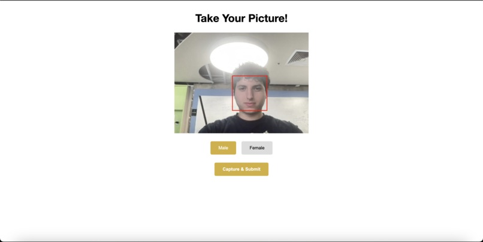

# 🧠 Face Shape Analyzer & Style Recommender

This project uses AI to detect your face shape through a webcam and recommends personalized hairstyles and glasses based on your facial features and structure.

## 🌐 Live Demo
[Coming Soon]

## 🧩 Tech Stack

- **Frontend:** React, React Router, OpenCV.js, Webcam
- **Backend:** Flask, PyTorch, VGG16
- **Model:** Pre-trained VGG16 fine-tuned for face shape classification

## ✨ Features

- Face detection with webcam
- Face shape classification using a fine-tuned VGG16 model
- Personalized hairstyle and glasses suggestions for both male and female users
- Interactive UI to view results and try different looks

---

## 📬 API Overview

### `POST /api/analyze`

Accepts a base64-encoded image and selected gender, returns a predicted face shape and corresponding hairstyle recommendations.

#### Request Body:
```json
{
  "image": "data:image/jpeg;base64,...",
  "gender": "male" | "female"
}
```

#### Response:
```json
{
  "result": "oval",
  "hairstyles": [
    {
      "id": 21,
      "name": "Buzz Cut",
      "image": "/images/male/buzz-cut.jpg"
    },
    ...
  ],
  "glasses": [
    {
      "id": 29,
      "name": "Round",
      "image": "/glasses/Round.png"
    },
    ...
  ]
}
```

---

## 🖼️ Demo Screenshots

### 🏠 Home Page


### ✨ Our Mission


### 📸 Webcam Capture


### 🧠 Results Page


---

## 📖 How it works

- Webcam Capture: Users capture a selfie directly through their webcam.
- Face Detection: The app uses OpenCV.js for detecting the face area.
- Face Shape Prediction: The backend runs the captured face through a fine-tuned VGG16 model to classify the user's face shape (oval, heart, square, round, oblong).
- Personalized Recommendations: Based on the face shape and gender, the system provides: 
  - A set of recommended hairstyles.
  - A set of recommended glasses.
- Interactive Results Page: Users can view and explore different recommended styles and eyewear.

---

## 👨‍💻 Authors

<table>
  <tr>
    <td align="center">
      <a href="https://github.com/Yahialqur">
        
        <br />
        <strong>Yahia Alqurnawi</strong><br/>
        @Yahialqur
      </a>
    </td>
    <td align="center">
      <a href="https://github.com/Spec1alKs">
        
        <br />
        <strong>Jon Kruja</strong><br/>
        @Spec1alKs
      </a>
    </td>
  </tr>
</table>
